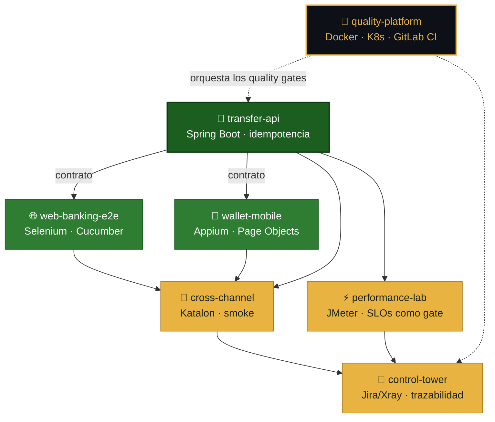

  

  

  
  
  
  

  

## 🎯 Sobre mí

**QA Engineer** enfocado en **automatización y SDET**. Vengo del desarrollo full-stack, y uso ese criterio de ingeniería para construir automatización de calidad de punta a punta: frameworks **E2E**, de **API** y **mobile**, pipelines **CI/CD** con quality gates, **performance**, **seguridad shift-left** y **testing de aplicaciones con IA**.

🌱 **Actualmente:** profundizando en arquitectura de frameworks SDET y en el testing de sistemas no deterministas (LLMs).

## 🧪 Cómo trabajo

> El diferencial no es la herramienta: es **poder demostrar cada afirmación**.

- **🧬 Un dueño por riesgo.** Selenium no reimplementa lo que ya prueba la API; Katalon no duplica la regresión de Selenium. Cada herramienta cubre el riesgo que le corresponde, y nada se prueba dos veces.
- **🚦 Los gates bloquean de verdad.** Y verifico también su **modo de fallo**: un gate que nunca falla no prueba nada.
- **📐 Evidencia honesta.** Cada repositorio distingue explícitamente lo que **se ejecutó** de lo que **no**:

| | Significado |
|:---:|:---|
| 🟢 | **Ejecutado y verificado.** Hay salida real, reproducible con un comando. |
| 🔴 | **No ejecutado** en ese entorno (licencia, emulador o cuenta cloud). El código es real; la limitación se declara. |

  

## 🏦 Nexo Finanzas · ecosistema de calidad para banca

  
  
  

No son siete tutoriales sueltos: es **un producto financiero ficticio** con sus siete capas de calidad, que se integran entre sí.

| # | Repositorio | Qué demuestra | Evidencia | CI |
|:--:|---|---|:--:|---|
| 1 | **[nexo-transfer-api](https://github.com/fercarballo/nexo-transfer-api)** | API de transferencias: **idempotencia**, autorización por titularidad, trazabilidad · `Spring Boot` | 🟢 |  |
| 2 | **[nexo-web-banking-e2e](https://github.com/fercarballo/nexo-web-banking-e2e)** | Framework UI mantenible: **Page Object Model**, esperas web-first · `Selenium` `Cucumber` | 🟢 |  |
| 3 | **[nexo-wallet-mobile](https://github.com/fercarballo/nexo-wallet-mobile)** | Abstracción de **dos modos**: la suite corre sin emulador · `Appium` | 🟢🔴 |  |
| 4 | **[nexo-cross-channel-regression](https://github.com/fercarballo/nexo-cross-channel-regression)** | Smoke cross-channel + **validador estático propio** como gate · `Katalon` | 🟢🔴 |  |
| 5 | **[nexo-performance-lab](https://github.com/fercarballo/nexo-performance-lab)** | Hipótesis → **capacidad medida (~460 rps)**; SLOs como gate · `JMeter` | 🟢 |  |
| 6 | **[nexo-quality-control-tower](https://github.com/fercarballo/nexo-quality-control-tower)** | Matriz **requisito → prueba → resultado**; gate ante requisitos sin cobertura · `Jira/Xray` | 🟢🔴 |  |
| 7 | **[nexo-quality-platform](https://github.com/fercarballo/nexo-quality-platform)** | Entorno reproducible; **rolling update con 0 fallos** · `Docker` `K8s` `GitLab CI` | 🟢 |  |

<b>📌 Tres hallazgos que valen más que el código</b>

 

- **⚡ El p99 se rompe antes que el p95.** En el laboratorio de performance, a 300 usuarios el promedio decía `304 ms` y mentía: el p99 era `1154 ms`. La cola de la distribución es la alarma temprana, no el promedio.
- **🚀 Un rolling update sin corte no es magia.** Son tres líneas de manifiesto: `maxUnavailable: 0`, dos réplicas y una `readinessProbe` distinta de la liveness. Lo medí: **0 peticiones fallidas** durante el despliegue.
- **🕳️ El hueco más peligroso es el requisito que nadie prueba.** Ninguna suite lo detecta — porque no existe. Por eso la torre de control **falla el pipeline** cuando un requisito no tiene ni una prueba.

  

## 🧰 Suite de Automatización de Calidad

  

Diez proyectos que recorren el ciclo de testing completo, de los fundamentos a las prácticas propias de un rol SDET. Cada uno con tests ejecutados, documentación técnica y CI.

<b>🧱 Fundamentos</b> &nbsp;—&nbsp; E2E · API · CI/CD · flakiness · visual & contract

 

| Proyecto | Foco | Stack |
|---|---|---|
| [Framework E2E de UI](https://github.com/fercarballo/playwright-e2e-framework-saucedemo) | Page Object Model, fixtures, cross-browser | `Playwright` `TypeScript` |
| [Testing de API](https://github.com/fercarballo/api-testing-framework-restful-booker) | Contract testing, casos negativos, encadenamiento | `Playwright` `Zod` |
| [Pipeline CI/CD](https://github.com/fercarballo/qa-automation-cicd-pipeline) | Quality gates, dos velocidades, matriz + sharding | `GitHub Actions` |
| [Estabilidad y flakiness](https://github.com/fercarballo/flakiness-hunting-playwright) | Diagnóstico y erradicación: **85 % → 0 %** | `Playwright` |
| [Regresión visual & contract](https://github.com/fercarballo/visual-and-contract-testing) | Screenshots + Pact consumer-driven | `Playwright` `Pact` |

<b>🚀 Avanzado (SDET)</b> &nbsp;—&nbsp; performance · integración · DevSecOps · tooling · IA

 

| Proyecto | Foco | Stack |
|---|---|---|
| [Performance & load testing](https://github.com/fercarballo/performance-testing-k6) | Escenarios de carga, thresholds como gate | `k6` |
| [Integración con dependencias reales](https://github.com/fercarballo/integration-testing-testcontainers) | Postgres efímero, constraints y tipos reales | `Testcontainers` `PostgreSQL` |
| [DevSecOps](https://github.com/fercarballo/devsecops-pipeline) | Seguridad shift-left: SAST · SCA · DAST como gates | `Semgrep` `npm audit` |
| [Tooling interno de QA](https://github.com/fercarballo/qa-insights) | Test impact analysis + detección de flaky tests | `TypeScript` |
| [Evals de aplicaciones con IA](https://github.com/fercarballo/llm-evals-harness) | Golden dataset, scorers y umbral como gate | `LLM testing` |

  

## ⚙️ Stack

**Testing & Automatización**

**Performance & Confiabilidad**

**Lenguajes**

**CI/CD & Infraestructura**

**Calidad, Seguridad & IA**

  

## 📊 Actividad

  <picture>
    <source media="(prefers-color-scheme: dark)" srcset="https://github-profile-summary-cards.vercel.app/api/cards/profile-details?username=fercarballo&theme=github_dark" />
    
  </picture>

  <picture>
    <source media="(prefers-color-scheme: dark)" srcset="https://github-profile-summary-cards.vercel.app/api/cards/repos-per-language?username=fercarballo&theme=github_dark" />
    
  </picture>
  <picture>
    <source media="(prefers-color-scheme: dark)" srcset="https://github-profile-summary-cards.vercel.app/api/cards/most-commit-language?username=fercarballo&theme=github_dark" />
    
  </picture>

  <picture>
    <source media="(prefers-color-scheme: dark)" srcset="https://streak-stats.demolab.com?user=fercarballo&theme=dark&hide_border=true&background=0D1117&stroke=E8B341&ring=E8B341&fire=E8B341&currStreakLabel=E8B341" />
    
  </picture>

  <picture>
    <source media="(prefers-color-scheme: dark)" srcset="https://github-readme-activity-graph.vercel.app/graph?username=fercarballo&bg_color=0D1117&color=E8B341&line=2EA043&point=FFFFFF&area=true&hide_border=true" />
    
  </picture>

  <picture>
    <source media="(prefers-color-scheme: dark)" srcset="https://raw.githubusercontent.com/fercarballo/fercarballo/output/github-snake-dark.svg" />
    
  </picture>

   
  <i>«Un gate que nunca falla no prueba nada.»</i>
    
  

